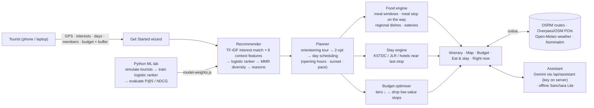

# Architecture

## Modules
| Layer | File | Responsibility |
|---|---|---|
| Data | `assets/js/data/*.js` | 31 districts, 175 places, 60 dishes, 29 eateries, 49 stays, photos, district map |
| Core | `engine/core.js` | Haversine and road-distance model, travel modes & costs, meal windows, NOAA sunrise/sunset, crowd prediction, tokenizer |
| Recommender | `engine/recommender.js` | TF-IDF index, Rocchio user vector, features, logistic scoring, MMR, explanations, search |
| Planner | `engine/planner.js` | Orienteering tour + 2-opt, day scheduler with meals, stays and sunset, cost model, budget optimiser, on-the-spot mode, share text |
| Assistant | `engine/assistant-lite.js`, `api/_gemini.js` | Offline intent + retrieval assistant; Gemini with plan-grounded context |
| Services | `services/live.js` | Geolocation, Nominatim, OSRM, Overpass, Open-Meteo, Google Maps deep links, `/api/assistant` |
| UI | `ui/*.js`, `app.js`, `styles.css` | Landing, wizard, results tabs, Leaflet map, EN/ಕನ್ನಡ, PWA |
| Server | `server.js`, `api/assistant.js` | Zero-dependency static server + AI endpoint; Vercel function for deployment |
| ML lab | `ml/*` | Tourist simulator, ranker training & evaluation, planner evaluation, charts |

## Ranking model
`score = sigmoid(b + w·x)`, where x = [interest, proximity, popularity, season, crowdCalm, groupFit, budgetFit, openFit], each scaled 0–1.
The weights are learned by `ml/train_ranker.py` (logistic regression with balanced classes, split by tourist) and exported to `engine/model-weights.js`.

## Planner objective
Maximise Σ relevance^1.5 − 0.13·detour_hours − 0.6·detour_cost/budget + 0.07·(new interests covered),
subject to the trip's time budget and pace (max stops per day). The result is polished with 2-opt, then scheduled with opening hours, meal windows (breakfast 8–11, lunch 12–3, snacks 4–7, dinner 8–11) and a stay each night.
